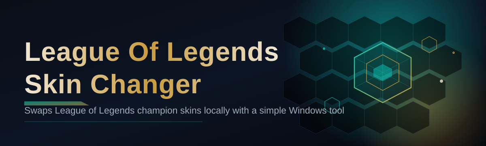
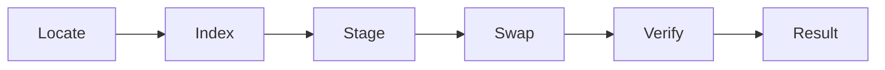

# lol-skin-editor 🎨🗿

  

*Reskin your favorite champions locally, instantly, and entirely offline — no launcher drama required.*

## 🌌 Overview

**lol-skin-editor** is a weekend-project-turned-obsession: a local skin-swapping toolkit built for players who want their client to *feel* like the store already spent the RP for them. It reads your installed champion assets, swaps in community-made or custom skin files, and hands your client a fresh coat of paint before you even hit the Rift. No accounts touched, no servers pinged, no funny business — just files, swapped cleanly, on your machine.

This exists because skin collections are expensive, chroma variants are limited, and sometimes you just want Championship Zed on a Tuesday. The League of Legends Skin Changer scene has always been full of half-finished tools with dead download links and sketchy installers — this one aims to be the opposite: transparent, minimal, and actually maintained in 2026.

Who's it for? Theorycrafters who want to preview unreleased skin concepts, content creators who need a specific look for a clip, and anyone tired of staring at the default recolor for a champion they've played four thousand times. If you know what a `.wad` file is, you'll feel at home. If you don't, the UI carries you.

> [!NOTE]
> This tool operates entirely on local game files. It does not modify anything server-side, does not touch matchmaking data, and does not communicate with Riot's backend.

  

---

## 🧩 What It Actually Does

**Champion-aware asset detection** — points at your League install and auto-maps every champion folder, no manual path-hunting.

**One-click skin swaps** — pick a champion, pick a skin file, apply. The editor handles file staging and cleanup automatically.

**Chroma-level color tweaks** — nudge particle colors and recall VFX tints without needing a full custom skin package.

**Sound & VFX overrides** — swap ability sound sets and particle effects independently of the visual model, if a mod pack supports it.

**Rollback in one click** — every change is reversible; a "Restore Default" button undoes any swap instantly.

**Batch profile loading** — save a set of skins as a "loadout" and apply all of them in a single pass before a session.

**Live preview panel** — inspect a model/texture before committing, so you're not gambling on a thumbnail.

**Conflict detection** — flags mismatched skin versions against your current client patch so you're not left with a black-texture champion.

| Capability | Status | Notes |
|---|---|---|
| Champion asset mapping | ✅ Stable | Auto-refreshes on patch |
| Chroma tint editor | ✅ Stable | Supports custom hex |
| Sound override | 🧪 Beta | Some ability sets unsupported |
| Batch loadouts | ✅ Stable | Up to 20 champions |
| Cloud sync | ❌ Not planned | Stays local by design |

---

## 🚀 How To Get Started

> [!TIP]
> Close the League client before applying any skin changes — file locks will otherwise block the swap.

1. **Visit the landing page** using the download button above.

2. **Grab the latest build** — it's a standalone executable, no bundled installer nonsense.

3. **Run it once** to let it auto-detect your League install directory (or point it manually if auto-detect misses).

4. **Pick a champion, pick a skin, hit Apply.** Launch League and enjoy the new look.

---

## 🖥️ System Requirements

- Windows 10 or Windows 11 (64-bit)

- ~200MB free disk space for the app and cached assets

- A local League of Legends installation

- No .NET, no Python, no external runtimes — it's fully standalone

> [!IMPORTANT]
> Always verify you're downloading from the official landing page linked in this README. Third-party mirrors are not endorsed and may bundle unrelated software.

---

## ⚙️ How It Works

The pipeline is intentionally simple — five steps, no black magic:

1. **Locate** — scans common install paths and lets you confirm the League directory.

2. **Index** — reads champion `.wad` archives and builds a local skin/asset map.

3. **Stage** — copies the chosen skin's files into a sandboxed working folder.

4. **Swap** — replaces the active asset references, preserving originals for rollback.

5. **Verify** — checks file integrity so a mismatched patch version doesn't produce broken textures.

---

## 🧯 Troubleshooting

<strong>My champion shows a black or missing texture after applying a skin.</strong>

Usually a patch mismatch — the skin file was built for an older client version. Update the skin pack or use "Restore Default" and try a newer variant.

<strong>The app can't find my League install.</strong>

Point it manually at your `League of Legends` folder — this happens most often with non-default install drives.

<strong>League won't launch after I applied a skin.</strong>

Restore defaults, then relaunch. If it persists, a client patch likely changed the underlying asset structure — check for an editor update.

<strong>Do skin changes appear to other players in-game?</strong>

No. These are local visual overrides visible only on your own client.

<strong>Can I use this with ranked matches?</strong>

> [!WARNING]
> Client-side modifications carry inherent account risk per Riot's terms. Use at your own discretion — see the disclaimer below.

---

## 🎛️ UI & UX Details

**Keyboard shortcuts:**

| Action | Shortcut |
|---|---|
| Apply skin | `Ctrl + Enter` |
| Restore default | `Ctrl + R` |
| Open champion search | `Ctrl + F` |
| Toggle preview panel | `Space` |

**Themes** — Dark (default), Light, and "Rift" high-contrast mode, switchable in Settings → Appearance.

**Settings** persist locally in a config file next to the executable — nothing roams, nothing syncs.

> [!NOTE]
> The live preview panel renders at reduced resolution for speed. In-game visuals are full quality.

---

## 🤝 Contributing & Community

Pull requests, skin-pack compatibility reports, and bug hunts are all welcome. Open an issue with your client patch version and a screenshot — vague reports get vague fixes.

- Fork, branch, PR — standard flow, keep commits scoped.

- Discussions tab is for skin-pack requests and feature ideas.

- Be excellent to each other; this is a hobby project, not a support hotline.

 

---

## 📜 License

Released under the [MIT License](LICENSE), 2026. Do cool things with it, credit appreciated.

---

## ⚖️ Disclaimer

> This project is an independent, fan-made tool and is not affiliated with, endorsed by, or sponsored by Riot Games. League of Legends is a trademark of Riot Games, Inc. All modifications are applied locally and client-side; usage may carry account risk under Riot's Terms of Service. Use responsibly and at your own risk.

  

